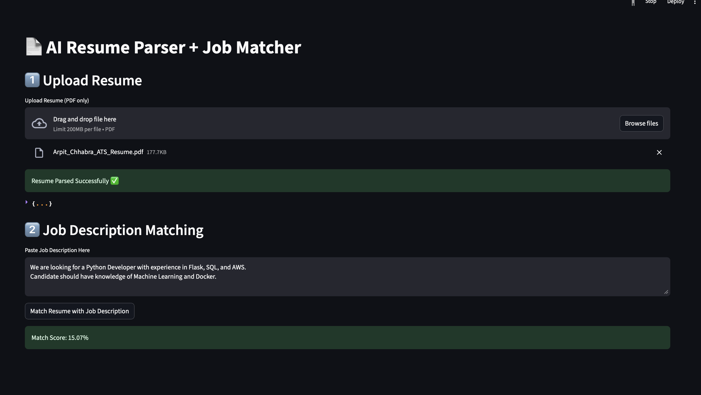
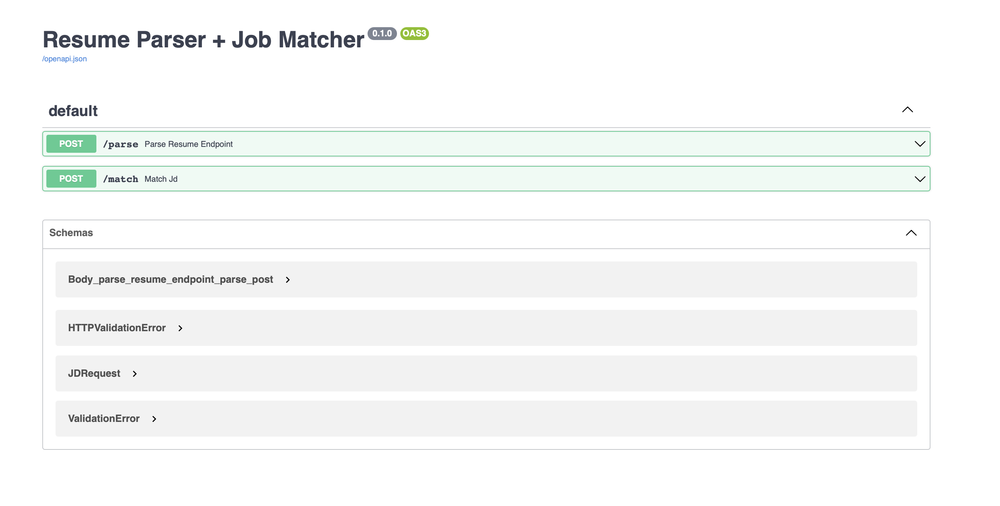

# AI Resume Intelligence Engine

A powerful tool to analyze resumes and match them with job descriptions using advanced AI models.

## Features

- **Resume Parsing:** Converts resumes into structured JSON using Qwen2.5-1.5B-Instruct.
- **Job Matching:** Calculates a matching score between resumes and job descriptions.
- **API Backend:** Built with FastAPI for robust and scalable endpoints.
- **Easy Deployment:** Containerized with Docker for seamless deployment.

## Getting Started

1. **Install dependencies:**
    ```bash
    pip install -r requirements.txt
    ```

2. **Run the application:**
    ```bash
    uvicorn app.main:app --reload
    ```

3. **Access the API documentation:**
    - Open [http://127.0.0.1:8000/docs](http://127.0.0.1:8000/docs) in your browser.

## Screenshots

```markdown


```
## License

This project is licensed under the MIT License.